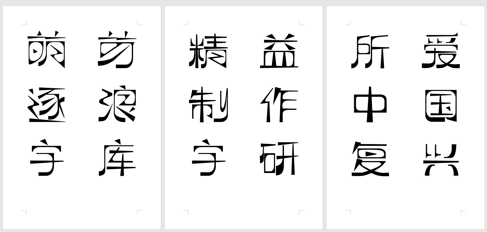
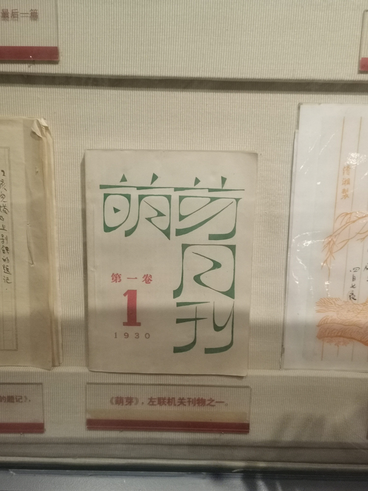

# Padyakke Libre

## About Padyakke

Font Family name: ZoomlaMengyas-A080

Chinese Name:逐浪萌芽字

字体类型：简体中文字库

Super short description of the Font Family:

A good Chinese character library，by Jiangxi ZoomlaCMS Soft Co. LTD,Belong to the z01 family.

It draws lessons from the style of China's 《meng ya》 magazine in the 1920s. It has remarkable characteristics of the times, easy to identify and unique style.

Chinese fonts follow GB2312 standard,English and Latin characters conform to GoogleFonts standards.

Official source files and compiled fonts are released at: https://github.com/z01font/ZoomlaMengyas-A080

## Important Technical Information

** Use FontCreator 14! **

web  Use FontCreator 14

We use  FontCreator  14 to compile this font. The font source file is:ZoomlaMengyas-A080.fcp.

Based on this file, you can compile it again to release or improve the application experience.

The help of FontCreator software can be accessed https://www.high-logic.com/support

## Contact

Z01 font team cares what you think! Please file issues on the Github project issue tracker, at https://github.com/z01font/ZoomlaMengyas-A080/issues or contact me privately at web@ziti163.com.

Official website: http://f.ziti163.com.

QQ Group:
    

QQ server：
   

## PreView

### License
This Font Software is licensed under the SIL Open Font License, Version 1.1.

This license is copied below, and is also available with a FAQ at:

http://scripts.sil.org/OFL

----

# 逐浪萌芽体

## 关于逐浪萌芽体

英文名称: ZoomlaMengyas-A080

中文名称:逐浪萌芽字

字体类型：简体中文字库

一套优秀的中文字库，逐浪字库团队出品。

中文字形部份符合中华人民共和国GB2312规范，英文与拉丁字形符合GoogleFonts开源规范。

## 创作理念 

一款参照近代中国共产党《萌芽》月刊的艺术字体。
源自五四运动文化，力求体现近代文艺风。

字体线条呈现外方内圆格局，有尖锐的外角、三角部件，而内部空间则呈现圆形切割效果。
这体现了五四、清末民初，在工业革命思维冲击下，一代文化人对于中国汉字的探索。
又似布尔什维克人的工人、工业文化在汉字下的体现。

尖锐、锐角三角形的部件，从中体现了上进、革命、进击。

结字扁形，即左右宽度大于上下高度。

- 1.外角采用尖角，内角采用弧角
- 2.是一个抽象的孤形字。
- 3.试图创造上个世纪30年代“左联”的手写字体风格，该风格是用于出版物出版，简朴又不失艺术性。
- 4.多弧形、多三角形。
- 5.整体偏矮宽方正型，非常规字体，异型字居多
- 6.笔画粗细对比明显，角的笔画相对横竖线要粗
- 7.竖线笔画下端粗上端细，横线笔画左边粗右边细
- 8.外角整体偏方形，内角整体偏圆形的创意字体
- 9.整体风格硬朗纤细

## 字体效果

## 使用文件 

04_成品：ZoomlaMengyas逐浪萌芽字.ttf

获取github仓库，选择"04_成品：ZoomlaMengyas逐浪萌芽字.ttf"字形，安装在你的操作系统上即可。
（你也可以点击github项目上的releases，下载发布包，它们是一致的）。

## 二次开发
使用FontCreator 14，打开“ZoomlaMengyas-A080.fcp”，即可进行二次开发。

## 创作笔记
一款字体，从前期创意，到基本造型，再到合成编程，再到优化出版。
最少需要3-5个月。
同时发布后还要针对各个场景进行修正优化，这是一个漫长的过程。
所以中国古代有“仓颉造字，鬼神哭”的说法。

逐浪字库在此发布自己的首个开源（此前开源字形多有借鉴临摹，未能达到原创规范），同时希望收获大家的批评指导，使我们能够长识进步。作为国内唯二的从字体、CMS、网站中台、字库、图标库全视觉呈现，逐浪不同于简式创意机构，而是一个重工具、重投入、重编程的公司，希望能为汉字与人类文化传播做出自己的贡献。

## 关于逐浪字库

一家创立18年的字库厂商，专注高端中文字库，官网：http://f.ziti163.com

## 获取支持
E-mmail:web@ziti163.com

QQ交流群号：
    

官方QQ客服：
   

## 许可证

基于SIL开源字体许可证1.1版，该版本网络链接：
http://scripts.sil.org/OFL
